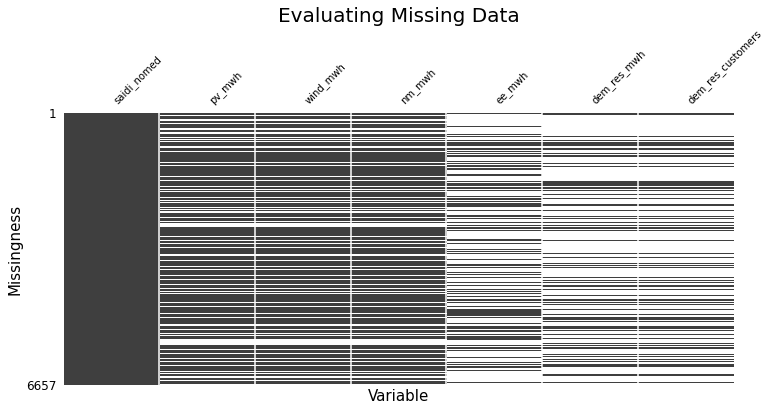
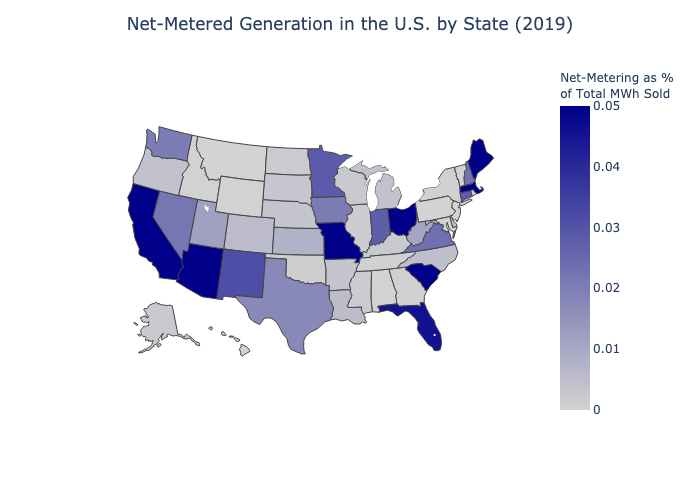
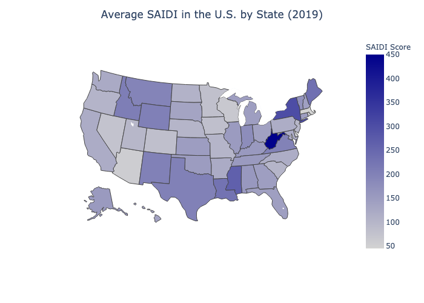
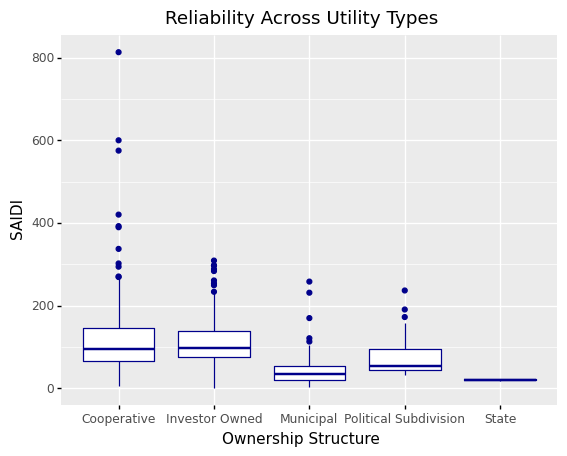
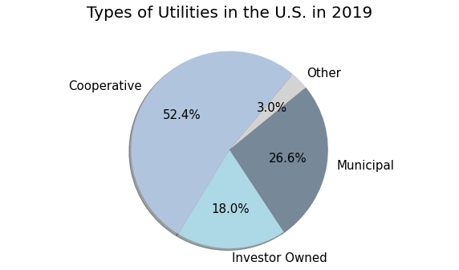
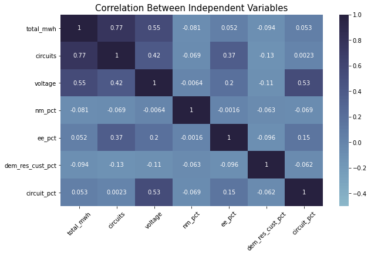
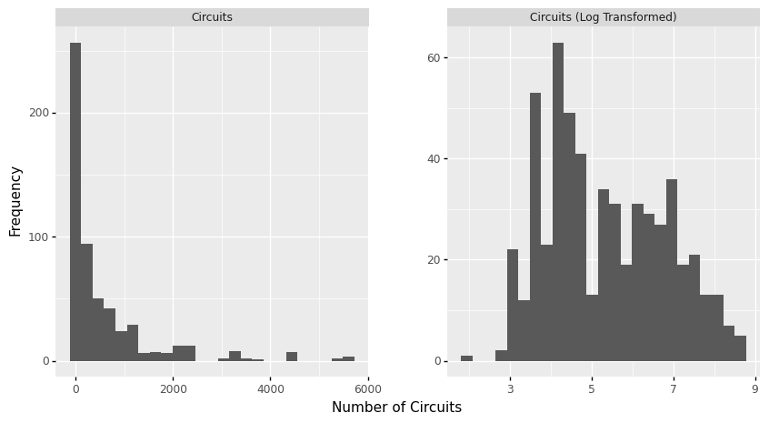
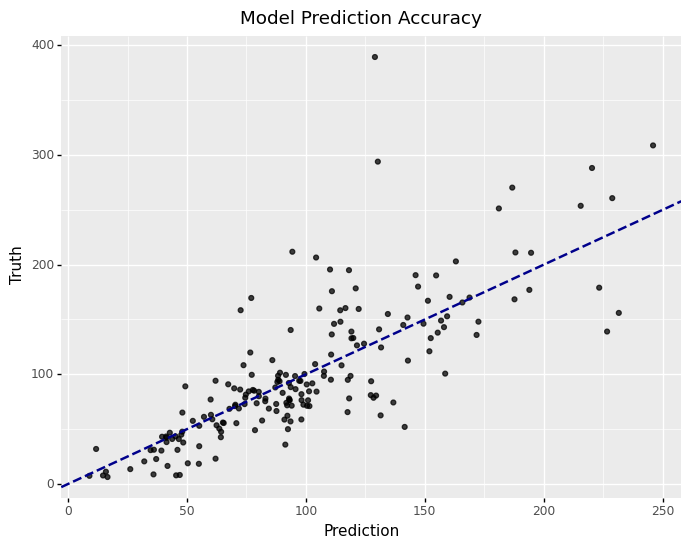
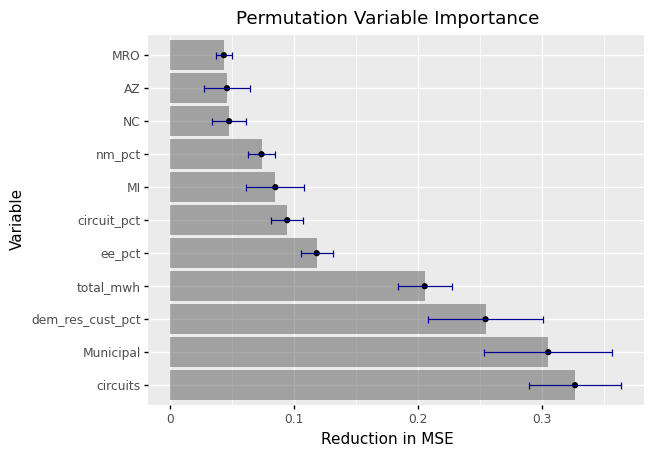

```{r setup, include=FALSE}
knitr::opts_chunk$set(echo = TRUE)
#knitr::opts_chunk$set(fig.pos = "!H", out.extra = "")
```

# Introduction

The energy grid as we know it is changing. As the costs of renewable electricity generation continue to fall, and more of these technologies are integrated onto the grid, the age-old challenges of grid reliability and resilience will gain new dimensions. My goals for this project are to examine the extent to which trends on the energy grid are correlated with, and predictive of, grid reliability as measured through interruptions to customer service.


In the first section of this report, I provide background and a problem statement to contextualize the goals of this project. In the next two sections, I describe the steps taken to wrangle the relevant data, as well as the visualization and machine learning methodologies employed to learn about the variables. In the last two sections, I explain the insights gained from the analysis and the steps that could be taken to expand the analysis in the future.


# Background and Problem Statement 

As anthropologist Gretchen Bakke wrote, “The grid… is the largest machine in the world.”$_{1}$ For centuries we have seen the one-way flow of electrons, from generation to transmission to distribution, and the top-down concentration of power – both literally and figuratively – in the hands of the nation’s electric utilities. However, in the last decade or so, the forces changing this dominant energy paradigm have begun to accelerate.

A primary driver of change is the rise of distributed energy resources, or DERs, such as rooftop photovoltaics, wind turbines, electric vehicles, and battery storage. These are electric generation assets deployed across the grid, supporting both behind-the-meter individual usage and aggregate usage. Alongside DERs, an interesting new entity has emerged: the “prosumer” – a traditional consumer who now has the capacity to produce electricity (usually through rooftop photovoltaics) and sell their excess back to the grid. This exchange, called net metering, has generated considerable policy debate in recent years as rooftop solar capacity in the U.S. has more than tripled between 2015-2020.$_{2}$


Some potential benefits of DERs include reduced greenhouse gas emissions, optimized distribution operations, grid flexibility (i.e., demand response capabilities), and greater customer choice. Some challenges include grid planning for bi-directional power flow, variable or intermittent power generation, and cross-subsidization (often cited in the context of net metering as an energy equity issue). $_{3}$ Additionally, utilities are oftentimes concerned about the lost revenue potential that accompanies a growth in DERs. DERs reduce a utility’s need to invest in more infrastructural and generation assets, which is how utilities generally earn money, and this cycle creates what many have called the ‘utility death spiral’.$_{4}$

It is clear that the future of the energy grid involves DERs, but we do not yet understand the implications of this widescale integration. The North American Electric Reliability Corporation (NERC), which maintains the reliability and adequacy of bulk power generation in four interconnections and six regional entities across North America, has warned that higher DER penetration on the grid may present new challenges to grid reliability.$_{5}$ These challenges may be due in part to the necessity for distribution system upgrades, wherein the cost-shifting problem arising from the “utility death spiral” becomes a complicating factor.$_{6}$


The high-level research question I explore in this project is: what is the relationship between net-metered distributed generation and grid reliability? In order to contextualize this question, I first looked into the literature that is publicly available. Particularly instrumental in expanding my understanding of grid reliability was the Public Utility Research Center’s (PURC) report on valuing municipal utilities.$_{7}$ 


In the section on utility benchmarking, the report employs an ordinary least squares (OLS) model to evaluate the correlation between variables such as customer density and ownership structure, and a utility’s grid reliability scores. The ownership structure of utilities can range from private investor-owned utilities (IOUs) to public municipality-owned utilities to rural electric cooperatives, or co-ops.


# Data
  
The data I used for this project was sourced from the U.S. Energy Information Administration’s Form 861, also known as the Annual Electric Power Industry Report.$_{8}$ It comprises data collected from over 3000 U.S. respondents, including electric utilities, wholesale power marketers and electric power producers; these respondents, which I refer to generally as utilities, are the units of analysis in my project. The data is divided into annual spreadsheets covering various portions of the survey, such as net metering, utility sales data, and energy efficiency programs. Because 2013 was the first year that my grid reliability metrics of choice were introduced, 2013-2019 formed the theoretical time range I could choose from to conduct my analysis.


When it comes to grid reliability, there are multiple ways in which it is measured. Two of the most common scoring systems include the System Average Interruption Duration Index (SAIDI) and System Average Interruption Frequency Index (SAIFI), which were both introduced in the 2013 EIA-861 survey. I ended up choosing to use SAIDI as my dependent variable because it had the most entries in the data. SAIDI is calculated using the following equation:


$$\frac{\sum Minutes\ of\  Interruption}{\sum Number\ of\ Customers}$$

EIA-861 includes SAIDI without Major Event Days (MED), which are interruptions to the electric power system that exceed a normal range, such as hurricanes or wildfire-induced outages.$_{9}$ As was done in the PURC report, I used this version of SAIDI to remove effects that were not correlated with my independent variables of interest.


My independent variables included both predictors and controls. While net-metered distributed generation is my predictor of interest, I also included other predictors that are correlated with grid reliability and distributed generation, such as energy efficiency and demand response programs. This served to reduce endogeneity and increase the predictive accuracy of my model. These predictor variables were reported in megawatthours (MWh) sold back to the utility in the case of generation and either MWh saved or number of enrolled customers for energy efficiency and demand response.


One of the key insights from the PURC report was that significant variation in reliability existed between utilities with different ownership structures and other characteristics. Therefore, I also included control variables such as the state, NERC region, ownership structure, utility sales (MWh), utility customers, number of distribution circuits and voltage optimized circuits. 


I conducted my data wrangling using Pandas, which was an iterative process because the later stages of my modelling sometimes produced findings that led me to alter the variables in my model.$_{10}$ My initial steps consisted of merging the datasets into annual data frames that contained all of the variables I needed. Then, I joined these data frames together, depending on which years I wanted to analyze. Though I wanted to automate this process, it was difficult because the spreadsheets from different years had varying header structures and naming conventions.


I cleaned the data and dealt with missing values by either imputing them with zeroes or dropping them altogether, assuming for the former method that when utilities did not have an entry for a certain survey section (such as net-metered capacity) it meant they had no generation to report. However, imputation with zeroes presented challenges when the energy efficiency and demand response variables exhibited 60-70% missingness, and I could not logically impute when SAIDI scores were missing (every utility has a reliability score, whether they report it or not). 


```{r, echo=FALSE, fig.align="center", fig.cap="This figure shows the missingness present in the 2013-2019 data after I dropped rows missing reliability data.", out.width = '90%'}

```


For my purposes, I counted the same utility in different years as separate entries. This may have led to autocorrelation issues that we have not yet covered, but I needed more data to compensate for the large amounts of missingness once I mapped my unit of analysis across the different spreadsheets.


# Analysis

My analysis consisted of three main methods: feature engineering, visualization, and modelling. After the initial data wrangling, I performed feature engineering to alter certain variables to be more appropriate for my analysis. This included dividing my predictor variables by the total megawatthours sold by a utility or the total customer count in order to make them proportional to the size of a utility. I also divided the number of voltage optimized circuits by total circuits to get the percentage.


Beyond the aforementioned missingness challenge, another problem with my data was that “some utilities reclassified net metering as non-net metering distributed, or vice versa.”$_{11}$ EIA-861 also reports non-net metering distributed generation; I only used the net metering data in order to avoid double counting, but this could have caused under-counting, depending on how individual utilities changed their reporting practices over time.


```{r, echo=FALSE,fig.align="center", fig.cap="This figure shows the percentage of a state's total MWh sold accounted for by net-metered generation.", out.width = '70%'}

```


```{r, echo=FALSE, fig.align="center",fig.cap="As you can see in the map above, West Virgnia had the longest average duration of power outages in 2019 per customer.", out.width = '70%'}

```


At the end of the wrangling, I had 753 total entries for the years ranging from 2013 to 2019 when I dropped NAs and 3,509 entries for the same period when I imputed with zeroes. This difference demonstrates the tradeoff between a skewed distribution with many zeroes and having more data to improve the predictive power of the model.


My second method included visualization, which was employed throughout the project to both glean insights into the processed data through exploratory data analysis and to communicate my modelling results in a convenient way. For my initial exploration, I used the 2019 data so I could have an accurate display of the most recent information on a per-utility basis.


```{r, echo=FALSE,fig.align="center", fig.show="hold", fig.cap="This figure compares SAIDI scores across different types of utilities, and also shows a few outliers in the cooperatives category with extremely high SAIDI scores.", out.width = '80%'}

```

```{r, echo=FALSE,fig.align="center", fig.cap= "The majority of utilities in the U.S. are rural electric cooperatives. The Other type includes political subdivisions and state-owned utilities.", out.width = '70%'}

```

I also used the Pandas Profiling package to generate a report that summarized key characteristics of my data frame.$_{12}$ This report revealed a large number of zeroes (47.9%) in my net metering variable as well as its composite variables, photovoltaic generation percentage (48.4%) and wind generation percentage (73.6%). This was my first hint that there would be very right-skewed distributions even after I dropped rows with missing values instead of imputing, which would have increased the proportion of zeroes further. Therefore, I decided to just use the total net metering variable, which encompassed photovoltaic, wind, and all other types of distributed generation sold back to the grid.


When I was exploring my data, I found that co-ops and IOUs had the highest SAIDI scores and therefore the highest duration of outages -- a finding that aligned with the PURC report. I noticed there were some outliers as well -- keeping them would diminish my model’s accuracy so I removed the entries with a SAIDI above 500.


I then investigated the correlation between my predictor variables using the Seaborn package.$_{13}$ Through this process, I found that the highest correlation was the 77% correlation between the total MWh sold by a utility and the total number of circuits serving its distribution territory, which makes sense intuitively. I decided to drop one of these at first to minimize multicollinearity, but later found that keeping both caused my model to be more predictive.


```{r, echo=FALSE, fig.align="center", fig.cap="This figure shows the correlation between my independent variables.", out.width = '90%'}

```

Lastly, I modelled my data using Scikit-learn machine learning techniques applicable to regression problems; these were OLS regression, K-Nearest Neighbors (KNN), and Decision Trees variants including Bagged regressors and Random Forests.$_{14}$ Prior to running my data through the machine learning pipeline, I performed high-level preprocessing on the entire dataset to prepare the data for the pipeline. This pre-processing consisted of dealing with categorical data types and highly skewed distributions through variable transformation.


The first transformation was straightforward: I turned the categorical control variables such as NERC region, state, and ownership structure into numerical dummy variables by expanding them into their variants and dropping one as a reference category. Upon doing this, my original 27 variables became 77 variables to account for the expanded list of NERC regions, states, and ownership structures. 10 states did not have remaining data once I dropped the rows containing missing values, including: Arkansas, Maine, Rhode Island, Vermont, D.C., Washington, West Virginia, Tennessee, Utah, and Wyoming. 


Dealing with the distributions of my predictor variables, however, was more complicated; the missingness in the entries created heavily right-skewed data, in both the cases where I imputed NA’s with zeroes and the cases where I dropped missing entries entirely. This is because a majority of utilities simply have very low amounts of net-metered generation, energy efficiency programs, and demand response participation to begin with. I attempted to address the skewedness with four methods: 1) logarithmic transformation, 2) square root transformation, 3) Box-Cox transformation, and 4) binning the data into three categories based on the median.$_{15}$ I evaluated the reduction in skewedness for each variable through bar chart visualization, and implemented the transformations that yielded the highest reduction.


```{r, echo=FALSE, fig.show="hold",fig.align="center",fig.cap="This is an example of how log transformation can reduce the skewedness in a variable's distribution. It shows the variable that represents the number of circuits for a given utility.", out.width = '90%'}

```


The second half of modeling involved splitting my data into a test and training set, tuning the hyperparameters, and then running the training data through my pipeline. I used GridSearchCV to find the estimators that led to the highest predictive accuracy, as measured by Mean Squared Error (MSE) and the R-squared (R2) score. For the KNN, this consisted of finding the ideal number of neighboring data points to evaluate, and for the decision tree models, this consisted of identifying a maximum branch depth and number of predictors to use as inputs.


Once I had specified my estimators in each model, I generated the pipeline, which first normalized my variables and then performed a final grid search to find the model with the lowest MSE. This model was then fitted to the test data and the predictive accuracy was visualized in a graph. I also permuted the features 25 times within the model and plotted the reduction in MSE attributed to each variable to generate a chart of variable importance, since this could provide further visual insights into the variables most instrumental to predicting grid reliability.


# Results


I ran several models with different combinations of the data years used (just 2019 or 2013-2019), methods of dealing with missingness (imputing with zeroes or dropping the rows), and variables (including/excluding controls, transformations to reduce skewedness). My initial experiments yielded very low R2 scores, sometimes even in the negatives, which told me that the configurations I used were not very predictive when employed in the pipeline.$_{16}$


My most successful model was a Random Forest regressor. When I fitted this model to my test data, it yielded the highest R2 score of 0.61 and a MSE of 1569.63. The MSE is difficult to interpret without context, so I derived the Root MSE (RMSE) to get a number in the units of my dependent variable. The RMSE was 39.62 minutes, meaning that the model’s prediction of SAIDI had an average error of ~40 minutes. This may seem high, but it is below the standard deviation of SAIDI in the test dataset, which was 63.66 minutes. Because the highest R2 score is 1, which would entail perfect prediction, the R2 score indicates a moderate fit of the model predictions to the actual data.


```{r, echo=FALSE, fig.show = "hold", fig.align="center", fig.cap= "This figure displays the predictive results from a Random Forest with 1250 estimators, a maximum of 40 variables used, and a maximum depth of 40 consecutive choices in each decision tree.", out.width = '70%'}

```


Ultimately, this Random Forest model would not be particularly useful for predicting grid reliability using data on net-metered generation, energy efficiency, and demand response. Its prediction will likely fall within one standard deviation of reality, but depending on what your application is, that may still leave too much room for error (~40 minutes of electrical outage). The more interesting insights from this project can be found through the exercise of permuting my variables to see which ones are the most predictive within the model.


```{r, echo=FALSE, fig.align="center",fig.cap="This figure shows the most consequential variables in the Random Forest model, in order.", out.width = '70%'}

```


In this chart, we see that the most important variable we used was the number of circuits, and total MWh is in the top 4; earlier, we saw that these two variables have the highest collinearity, but I kept them both to improve my model’s predictive power, and this chart reinforces why this was the case. 


My independent variable of interest, the percentage of a utility’s generation that was net-metered, is 8th on the list, which seems high compared to the 77 variables that were available but also trails some control variables such as utility ownership (Municipal) and state (MI). These controls are high in the list because there is a significant SAIDI difference between the utilities that fit their definition and utilities that do not.


# Discussion

My original definition of success in my project proposal was to run an OLS analysis on the correlation between net-metered generation and grid reliability, but this changed because 1) the project was supposed to be oriented more towards prediction than inference and 2) the fact that my other models outperformed the linear regressor shows that the relationships in my data may not be very linear. The project was successful in demonstrating the relative strength of the relationship between net-metered generation, energy efficiency, and demand response, and SAIDI, but the final model was only mildly successful in predicting grid reliability. 
	
There are several unanswered questions I would explore given more time. One of these is the difference between the types of net-metered resources, such as wind, solar, and battery storage, that are covered in EIA-861. As explained previously, these are very right-skewed variables in isolation, but there are theoretical reasons that they may have differential impacts on grid reliability.  Additionally, my final method of dropping missing values instead of imputing in order to avoid skewedness or inaccurate assumptions decreased my available data to the point where I needed to add more years. In the future, I would investigate how to deal with time series data and if the benefit of using lagged predictors variables (such as net-metered generation from the previous year) outweighed the cost of losing those rows of data. This method may provide a more robust view of impact of trends in increased distributed generation deployment on grid reliability.


# Works Cited

1. Bakke, Gretchen Anna. The Grid: the Fraying Wires between Americans and Our Energy Future. New York, NY: Bloomsbury, 2017. 

2. Meehan, Bill. “Solar, Wind, DERs Force Utilities to Change; Distributed Energy Resources.” Esri, May 16, 2018. https://www.esri.com/about/newsroom/publications/wherenext/utilities-business-model-change/. 

3. Rackliffe, Gary. “Distributed Grid Management 101: DERs Are Reshaping the Power Grid.” ABB Conversations , February 26, 2019. https://www.abb-conversations.com/2019/02/distributed-grid-management-101-ders-are-reshaping-the-power-grid/.

4. Lacey, Stephen. “This Is What the Utility Death Spiral Looks Like.” Greentech Media. Greentech Media, November 20, 2017. https://www.greentechmedia.com/articles/read/this-is-what-the-utility-death-spiral-looks-like. 

5. Rep. Distributed Energy Resources: Connection Modeling and Reliability Considerations. North American Electric Reliability Corporation, February 2017.

6. “Solar Energy and Net Metering.” Edison Electric Institute, January 2016. 

7. Kury, Ted, David Richardson, and Cindy Miller. Rep. Valuing Municipal Utilities – The Case of the Potential Sale of JEA in Jacksonville, 2018. 

8. “U.S. Energy Information Administration - EIA - Independent Statistics and Analysis.” Annual Electric Power Industry Report, Form EIA-861 detailed data files. Accessed December 19, 2020. https://www.eia.gov/electricity/data/eia861/. 

9. Eto, Joseph, and Kristina Hamachi LaCommare. Rep. Tracking the Reliability of the U.S. Electric Power System: An Assessment of Publicly Available Information Reported to State Public Utility Commissions , 2008.

10. Wes McKinney. Data Structures for Statistical Computing in Python, Proceedings of the 9th Python in Science Conference, 51-56 (2010) 

11. EIA Annual Electric Power Industry Report.

12. Simon Brugman.pandas-profiling: Exploratory Data Analysis for Python, 2019. https://github.com/pandas-profiling/pandas-profiling

13. Michael Waskom and team. mwaskom/seaborn, Zenodo, (2020). DOI: 10.5281/zenodo.592845

14. Fabian Pedregosa, Gaël Varoquaux, Alexandre Gramfort, Vincent Michel, Bertrand Thirion, Olivier Grisel, Mathieu Blondel, Peter Prettenhofer, Ron Weiss, Vincent Dubourg, Jake Vanderplas, Alexandre Passos, David Cournapeau, Matthieu Brucher, Matthieu Perrot, Édouard Duchesnay. Scikit-learn: Machine Learning in Python, Journal of Machine Learning Research, 12, 2825-2830 (2011).

15. S, Tamil Selvan. “Types Of Transformations For Better Normal Distribution.” Medium. Towards Data Science, May 29, 2020. https://towardsdatascience.com/types-of-transformations-for-better-normal-distribution-61c22668d3b9. 

16. “Sklearn.metrics.r2_score.” scikit. Accessed December 19, 2020. https://scikit-learn.org/stable/modules/generated/sklearn.metrics.r2_score.html. 


